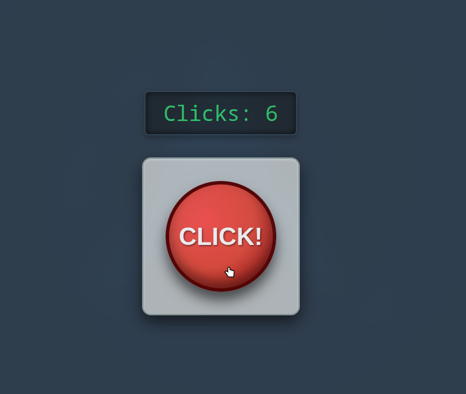
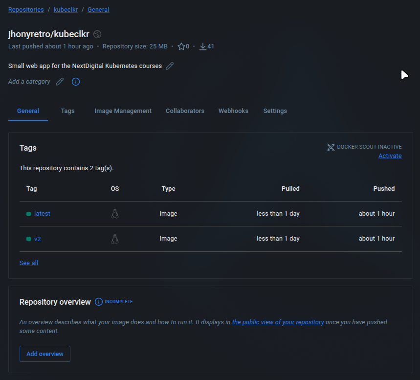
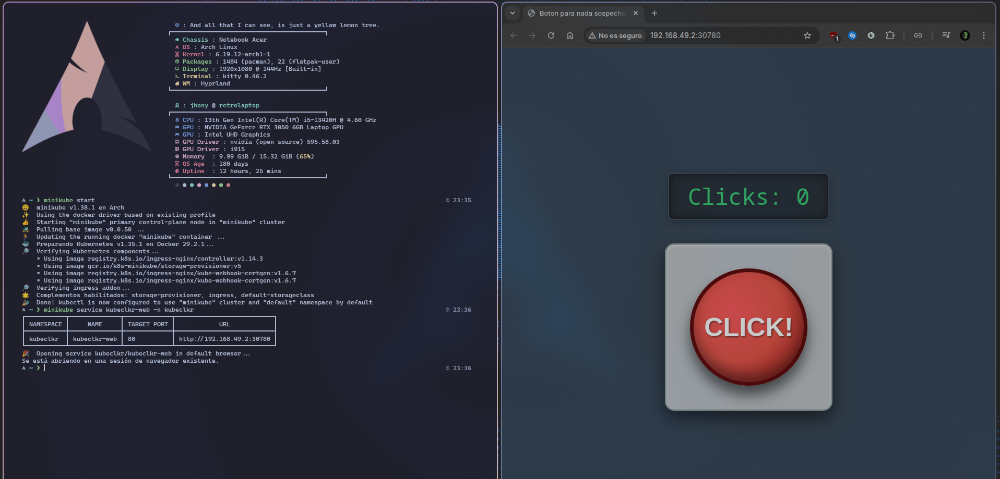
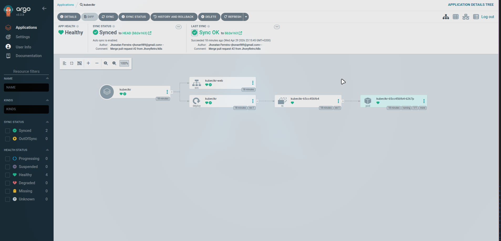

## Taller CI/CD II | Next Digital

Esta es una pequeña app web, desarrollada para utilizar con Kubernetes como se ha enseñado en los cursos de NextDigital.

Esta práctica consta de una aplicación web simple de un botón pulsador, parecido al típico juego clicker, la cual está contenerizada con Docker, y ha sido desplegada con Kubernetes



### Estructura del proyecto

- ### Carpeta principal
    Aquí encontramos los ficheros:


  - **clicker.html**: Código de la página web


  - **clicker.js**: Lógica interna de la página web


  - **Dockerfile y docker-compose**: Archivos de construcción de imagen de Docker. Existen ambas para poder utilizar tanto `docker build` como `docker compose`

    
  - **default.conf**: Configuración por defecto de nginx que copiaremos al contenedor, redirigiendo automáticamente a *clicker.html*.

- ### Carpeta k8s (Kubernetes)
    Aquí encontraremos los manifiestos de despliegue y servicio de Kubernetes.


- **app/deployment.yaml**
- **app/service.yaml**

### Trayectoria del proyecto

Una vez creada la app, lo siguiente era establecer un orden en el repositorio. Como regla básica de CI, la rama `main` se encuentra protegida, y todos los cambios deben ir asociados a una pull request.

Luego, utilizaremos Docker para construir una imagen con nginx, ya que se trata de una aplicación estática. Para maximizar compatibilidad, se ha optado por incluir tanto un Dockerfile como un fichero *compose*.

Para ello, crearemos una nueva etiqueta con Docker:

```
docker build -t jhonyretro/kubeclkr:v1 
docker push jhonyretro/kubeclkr:v1

# Podemos incluso hacer una etiqueta latest
docker tag jhonyretro/kubeclkr:v1 jhonyretro/kubeclkr:latest
docker push jhonyretro/kubeclkr:latest
```
Una vez subido a Docker Hub, deberemos ver nuestra imagen así:


Cuando tengamos todo esto, podemos movernos a la configuración de Kubernetes.
Como se trata de una aplicación muy simple y encima estática, optamos por usar el modelo RollingRelease, aunque si contásemos con funciones como un backend con base de datos, un modelo Recreate también podría ser apropiado.
Al crear los archivos de manifiesto, declaramos que nuestro pod hará pull de la imagen más reciente, y que este tendrá el puerto HTTP abierto. Aprovechando esto, podemos declarar que el HealthCheck de nuestra app es que la web funcione, por lo que ambos probes pueden ser una petición get al directorio raíz de la web.

En cuanto a tipo de servicio, al ser una app simple con un acceso sencillo, optamos por usar el NodePort, el cual nos permite conectarnos tanto internamente como externamente.

Para más comodidad, crearemos un namespace en Minikube:

```
minikube start
kubectl create namespace kubeclkr
cd k8s && kubectl apply -n kubeclkr -k .
minikube service kubeclkr-web -n kubeclkr
```


Por último, si queremos implementar GitOps, podemos hacer una aplicación en ArgoCD. Ésta se encargará de sincronizar automáticamente nuestro Cluster con los cambios que vayan apareciendo en el repositorio Git.
Aquí hay un ejemplo de cómo debería verse si está todo configurado correctamente:



### Consideraciones a futuro
- Expandir la app y hacer un juego completo (Sistema de logros, registro de puntuación, etc)
- Cambiar de modelo rolling a Recreate o a Canary para probar versiones futuras